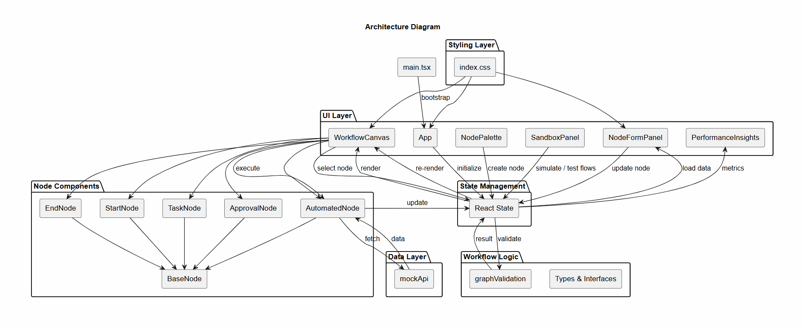
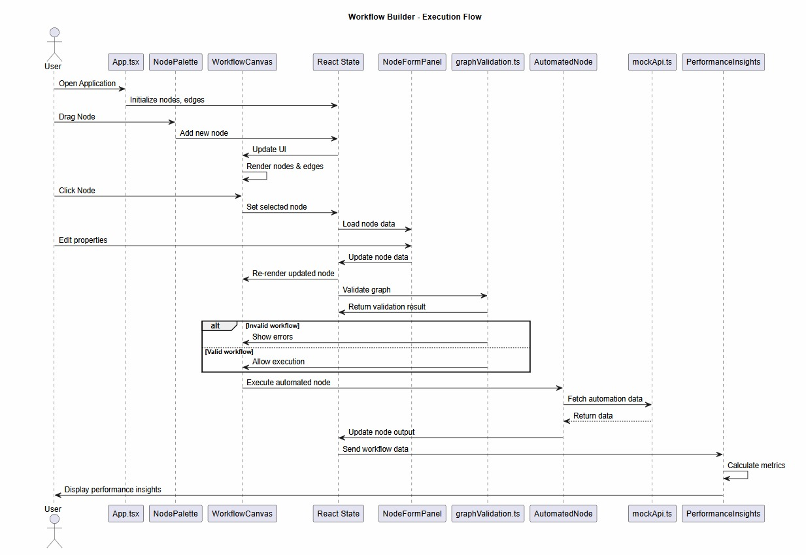
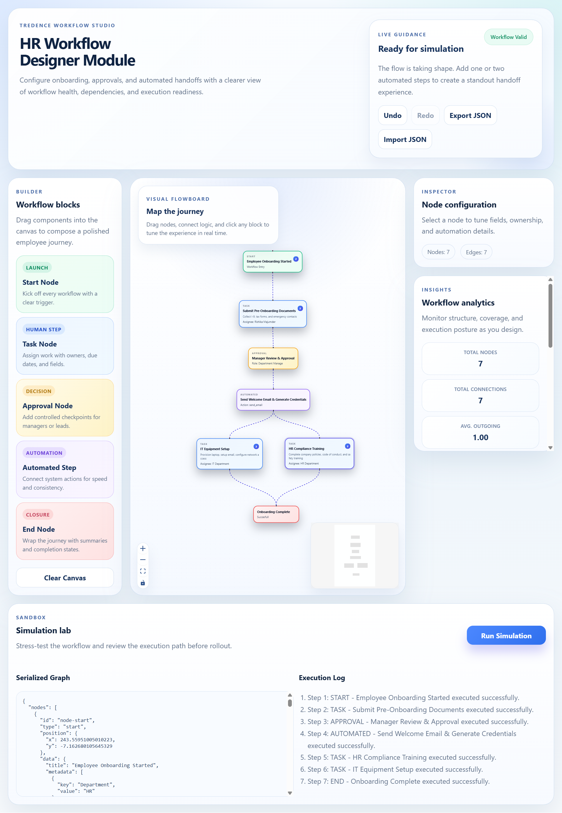

# HR Workflow Designer

A modern **React + TypeScript workflow builder** for HR processes with read-time validation, simulation and analytics.

---

## Core Features

### What is Implemented

- Drag-and-drop node creation from a left sidebar
- Custom node types with visual color coding:
  - Start Node (Green)
  - Task Node (Blue)
  - Approval Node (Yellow)
  - Automated Step Node (Purple)
  - End Node (Red)
- Real-time validation
- Workflow Automation (Mock API)

## Architecture

## Workflow

## Preview

## Run Locally
- Clone Repo: git clone https://github.com/yourusername/hr-workflow-designer.git

- Go To Project: cd hr-workflow-designer 

- Install Dependencies: npm install 

- Start App: npm run dev

- App runs at: http://localhost:5173

## Tech Stack
- React + TypeScript
- Vite
- React Flow
- Mock API
